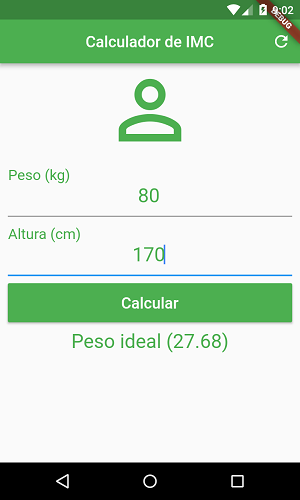

# calculador_de_imc

Projeto em Flutter para aprender sobre controle de estado, TextEditingController e GlobalKey<FormState>

## Getting Started

For help getting started with Flutter, view our online
[documentation](https://flutter.io/).
# calculadora_imc
